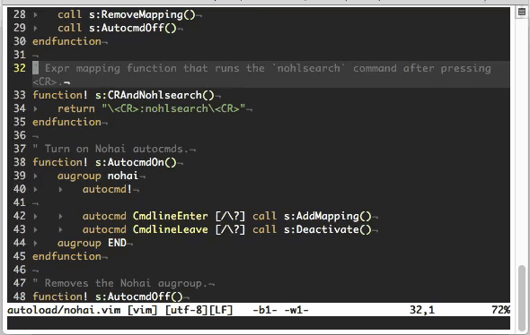

vim-nohai
=========

Nohai wraps Vim’s search commands, turning off search highlighting automatically
after searching. This allows for movement using the search commands with visual
feedback, while subsequently removing that feedback when it’s no longer needed.

## Demo

## License
Copyright © 2019 Teddy Wing. Licensed under the GNU GPLv3+ (see the included
COPYING file).
